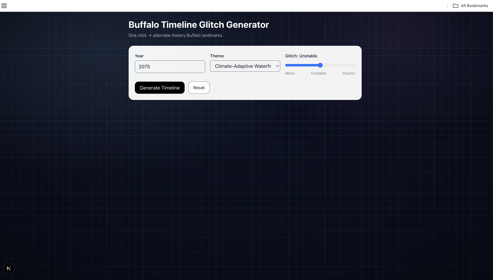
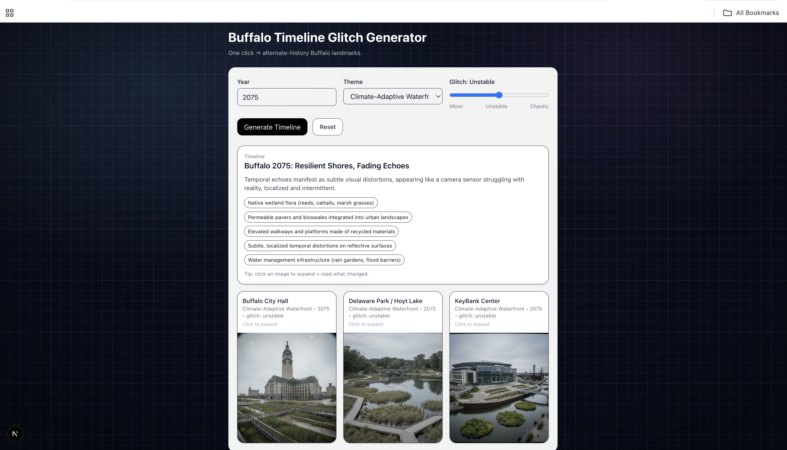
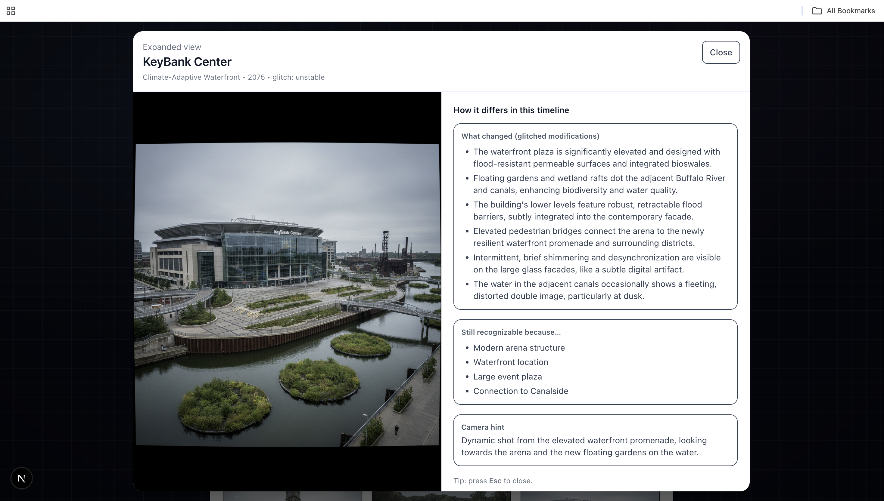

# 🕰️ Buffalo Timeline Glitch Generator

*What if Buffalo evolved down a different timeline?*

An AI-powered web app that imagines alternate-history futures of Buffalo landmarks.  
Pick a year, choose a theme, dial up the “glitch,” and watch familiar places transform into surreal timelines shaped by climate shifts, tech booms, utopias, or chaos.  
It’s a playful experiment in speculative design, blending creativity with AI-driven worldbuilding.

---

## How It Works

1. Select a year, theme, and glitch level.
2. The app uses an AI model to generate a coherent alternate timeline for Buffalo.
3. Three iconic landmarks are reimagined visually while preserving their identity.
4. Click any image to expand it and explore how that timeline differs from reality.

The experience is designed to be simple, interactive, and fun — no prompts or technical knowledge required.

---

## Features

- 🧠 AI-generated alternate timelines grounded in real Buffalo landmarks  
- 🎚️ Glitch slider controlling stability vs. chaos in the world  
- 🖼️ Clickable image cards with expanded explanations  
- 🔄 Reset & regenerate for endless experimentation  

---

## Tech Stack

- **Framework:** Next.js (App Router)
- **Frontend:** React 19 + Tailwind CSS
- **AI Models:**
  - Gemini 2.5 Flash (world & timeline generation)
  - Gemini 2.5 Flash Image (image generation)
- **Language:** TypeScript

---

## Running Locally

### 1. Clone the repository
```bash
git clone https://github.com/khushigupta11/time-glitch-generator.git
cd time-glitch-generator
```

### 2. Install Dependencies
```bash
npm install
```

### 3. Set up environment variables
#### Create a .env file in the root directory:
```bash
GEMINI_API_KEY=your_api_key_here
```
#### (Optional, for debugging only)
```bash
DEBUG_PROMPTS=1
```

### 4. Start the development server
```bash
npm run dev
```
#### Open http://localhost:3000 in your browser.

---

## Screenshots

### Main Page


### Generated Timeline


### Expanded Landmark View


---

## License
MIT License
© 2025 Khushi Gupta